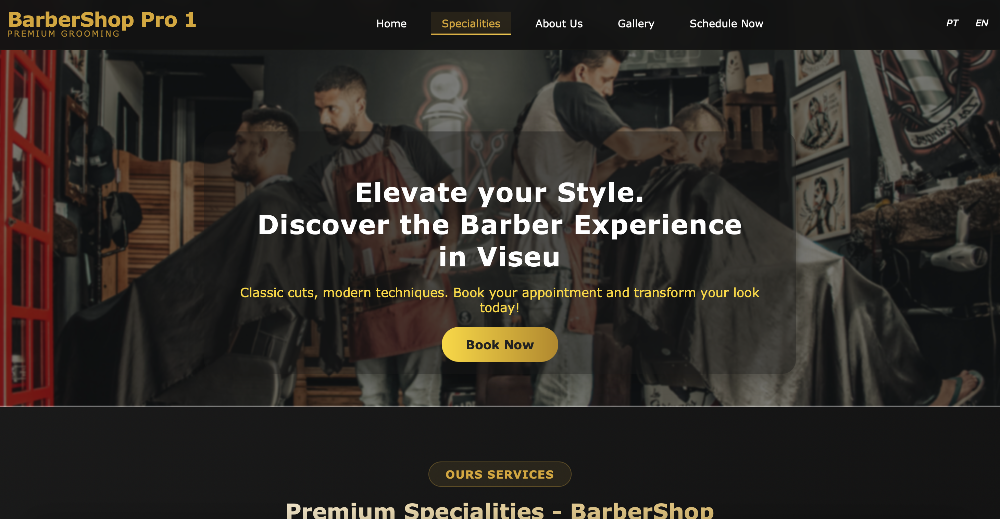
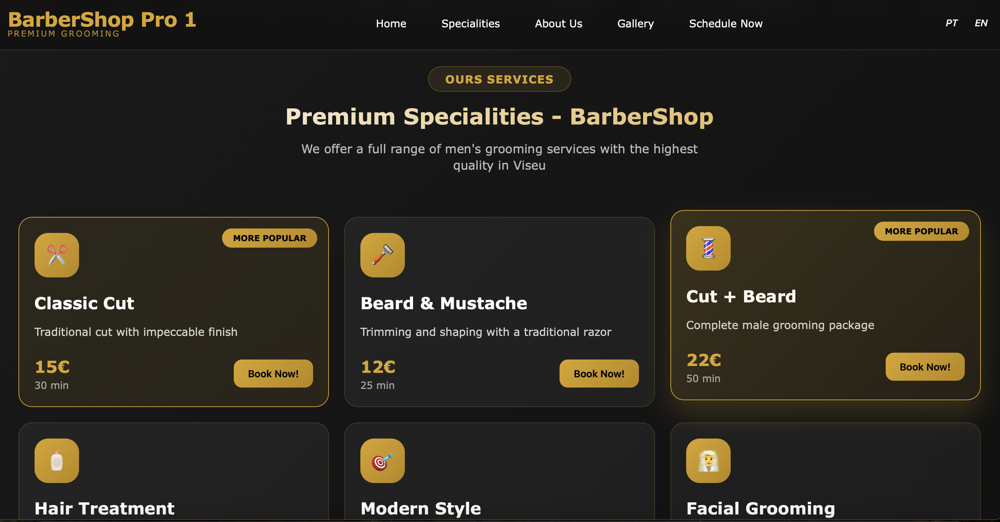
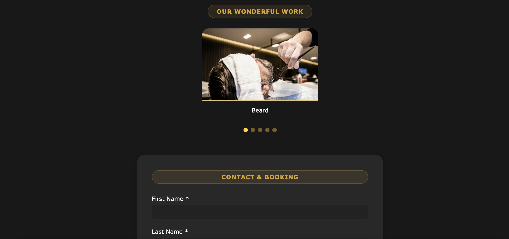
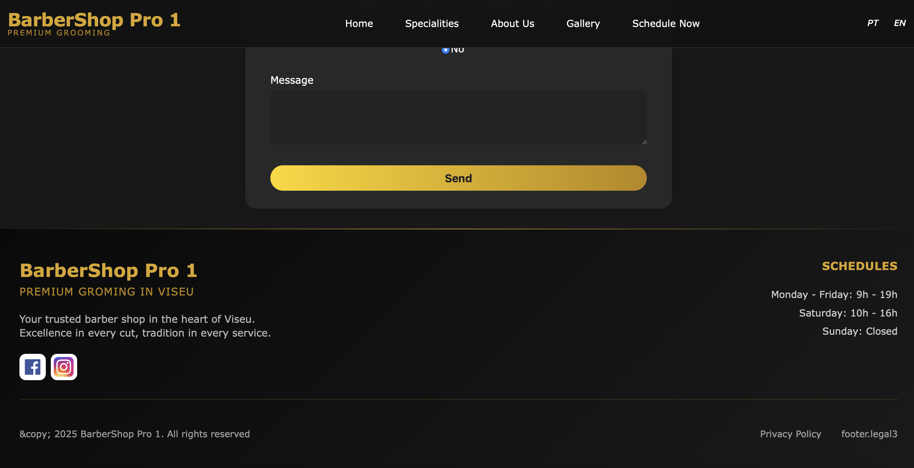

# BarberShop-Pro-1 · Front-end

Responsive single-page application for barbershops, built with React + Vite. Includes a gallery, About Us sections, services, English/Portuguese support, and a contact form that sends emails via EmailJS.

## Table of Contents
1. Demo
2. Folder Structure
3. Main Features
4. Environment Configuration
5. Environment Variables (EmailJS)
6. npm Scripts
7. Internationalization
8. License

### 1. Demo






### 2. Folder Structure
```python
.
├── eslint.config.js
├── index.html
├── package-lock.json
├── package.json
├── public
│   ├── docs
│   │   ├── website-barbershop-pro-1-1.png
│   │   ├── website-barbershop-pro-1-2.png
│   │   ├── website-barbershop-pro-1-3.png
│   │   ├── website-barbershop-pro-1-4.png
│   │   └── website-barbershop-pro-1-5.png
│   ├── images
│   │   ├── banner.jpg
│   │   ├── barber1.jpg
│   │   ├── barber2.jpg
│   │   ├── barber5.jpg
│   │   ├── barbershop.jpg
│   │   ├── footer
│   │   │   ├── facebook.png
│   │   │   └── instagram.png
│   │   ├── gallery1.jpg
│   │   └── gallery2.jpg
│   ├── locales
│   │   ├── en
│   │   │   └── translation.json
│   │   └── pt
│   │       └── translation.json
│   └── logo.png
├── README.md
├── src
│   ├── App.tsx
│   ├── assets
│   │   └── react.svg
│   ├── components
│   │   ├── AboutUs
│   │   │   ├── AboutUs.css
│   │   │   └── AboutUs.tsx
│   │   ├── BannerHome
│   │   │   ├── BannerHome.css
│   │   │   └── BannerHome.tsx
│   │   ├── Contact
│   │   │   ├── Contact.css
│   │   │   └── Contact.tsx
│   │   ├── Footer
│   │   │   ├── Footer.css
│   │   │   └── Footer.tsx
│   │   ├── Gallery
│   │   │   ├── Gallery.css
│   │   │   └── Gallery.tsx
│   │   ├── Navbar
│   │   │   ├── Navbar.css
│   │   │   └── Navbar.tsx
│   │   └── Specialities
│   │       ├── Specialities.css
│   │       └── Specialities.tsx
│   ├── i18n.ts
│   ├── index.css
│   ├── main.tsx
│   └── vite-env.d.ts
├── tsconfig.app.json
├── tsconfig.json
├── tsconfig.node.json
└── vite.config.ts
```

### 3. Main Features
* React + Vite + TS
* CSS responsivo (desktop / tablet / mobile)
* EmailJS integrado (`src/components/Contact`)
* i18next → EN & PT
* Lazy-loading images

### 4. Environment Configuration
npm install
npm run dev            # http://localhost:5173

### 5. Environment Variables (EmailJS)
Crie `.env` na pasta `client`:
EMAILJS_SERVICE_ID = 'xxxx'
EMAILJS_TEMPLATE_ID = 'yyyy' 
EMAILJS_PUBLIC_API_KEY = 'zzzz'

### 6. npm Scripts
| Script            | Descrição                     |
|-------------------|------------------------------|
| `npm run dev`     | dev-server Vite              |
| `npm run build`   | build de produção em `dist`  |
| `npm run preview` | pré-visualiza build local    |

### 7. Internationalization
Translation files in `public/locales/en` and `public/locales/pt`.

### 8. License
MIT

